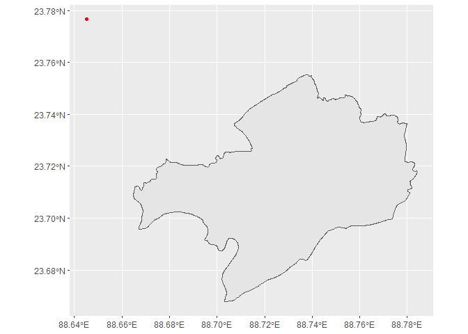
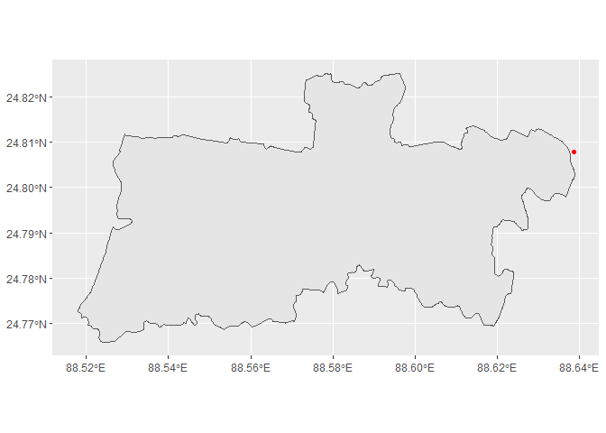
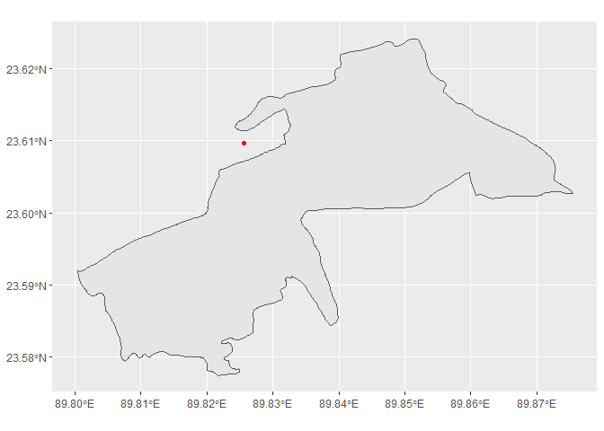
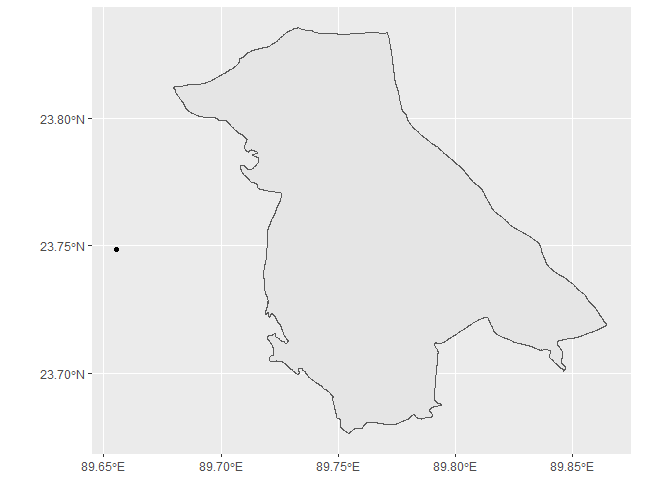
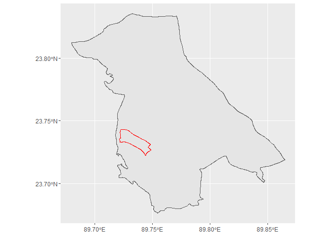
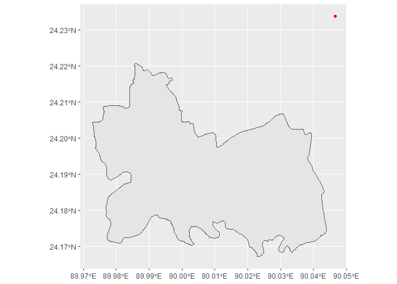
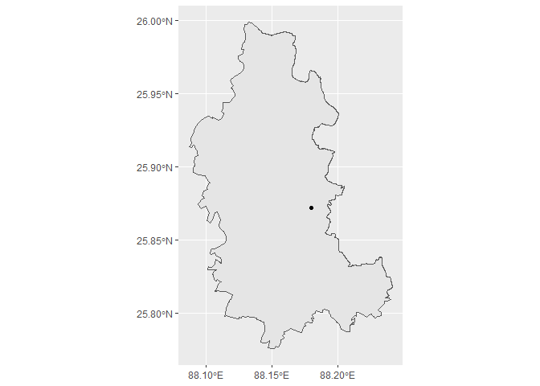
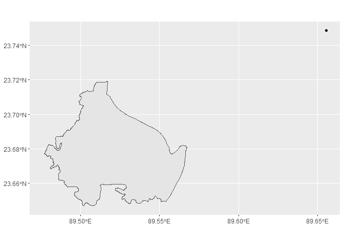
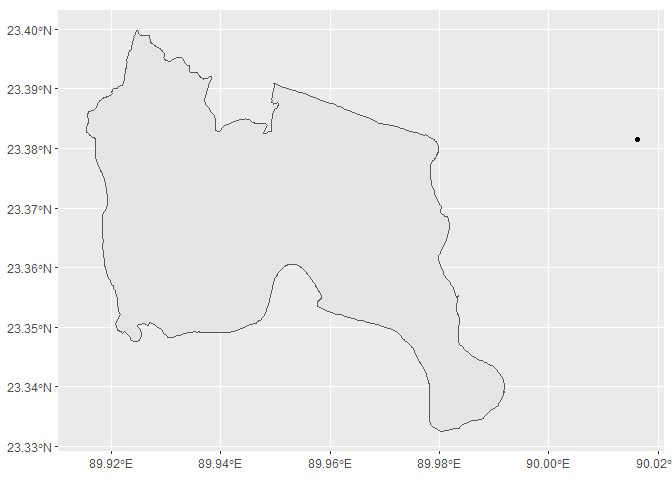

Nipah sites notebook
================

-   [India](#india)
    -   [ind_88](#ind_88)
    -   [ind_63](#ind_63)
-   [Bangladesh](#bangladesh)
    -   [bgd_87](#bgd_87)
    -   [bgd_76](#bgd_76)
    -   [bgd_73](#bgd_73)
    -   [bgd_72](#bgd_72)
    -   [bgd_68](#bgd_68)
    -   [bgd_62](#bgd_62)
    -   [bgd_61](#bgd_61)
    -   [bgd_56](#bgd_56)
    -   [bgd_55](#bgd_55)
    -   [bgd_50](#bgd_50)
    -   [bgd_49](#bgd_49)
    -   [bgd_45](#bgd_45)
    -   [bgd_44](#bgd_44)

``` r
library(tidyverse)
```

    ## -- Attaching packages --------------------------------------- tidyverse 1.3.1 --

    ## v ggplot2 3.3.5     v purrr   0.3.4
    ## v tibble  3.1.5     v dplyr   1.0.7
    ## v tidyr   1.1.4     v stringr 1.4.0
    ## v readr   2.0.2     v forcats 0.5.1

    ## -- Conflicts ------------------------------------------ tidyverse_conflicts() --
    ## x dplyr::filter() masks stats::filter()
    ## x dplyr::lag()    masks stats::lag()

``` r
library(sf)
```

    ## Linking to GEOS 3.9.1, GDAL 3.2.1, PROJ 7.2.1

What I’ve tried to do here is first group incidents by country, then do
an individual section for each event. You’ll see that each section is
headlined by the ISO 3-digit country code and the unique identifier I
added to the Metabiota dataset in Google Sheets.

For general administrative boundaries, I’m using [the GADM
database](https://gadm.org/). When I start a new country, I download
that country’s geopackage into the directory
“./input_data/country/GADM/”, where I extract the file to that directory
instead of letting the unzipper create a new directory.

Because these files are large, you’ll want to use [Github’s Large File
Storage](https://git-lfs.github.com/) to track them. I would do the
following commands:

-   git lfs track “\*.zip”
-   git lfs track “\*.gpkg”

As of now, my goal is to have each incident with the following fields:

-   unique identifier
-   polygon geometry, if used
-   point geometry

We may want to consider adding a memo field to contain important
information about each incident but for now I’ve not done that.

What you might do is create a new R notebook and just start the document
like below (i.e. ignore all the stuff above here). Then when you’re
done, we can just append it to this doc.

## India

<https://censusindia.gov.in/2011census/findvillages.aspx>
<https://data.gov.in/catalog/complete-villages-directory-indiastatedistrictsub-district-level-census-2011?filters%5Bfield_catalog_reference%5D=166603&format=json&offset=0&limit=6&sort%5Bcreated%5D=desc>

<https://stategisportal.nic.in/stategisportal/>

First, let’s check the layers.

``` r
st_layers("./input_data/India/gadm36_IND.gpkg")
```

    ## Driver: GPKG 
    ## Available layers:
    ##     layer_name geometry_type features fields
    ## 1 gadm36_IND_3 Multi Polygon     2340     16
    ## 2 gadm36_IND_2 Multi Polygon      666     13
    ## 3 gadm36_IND_1 Multi Polygon       36     10
    ## 4 gadm36_IND_0 Multi Polygon        1      2

So I think the best strategy for using this data is to start at the
lowest level. Then you can also search across multiple geographies in a
single table.

``` r
india_gadm_3 <- st_read("./input_data/India/gadm36_IND.gpkg", layer="gadm36_IND_3") %>%
  janitor::clean_names()
```

    ## Reading layer `gadm36_IND_3' from data source 
    ##   `C:\Users\u0161776\OneDrive - Thomson Reuters Incorporated\new_projects\r_work\reuters-news-data_disease_gis\input_data\India\gadm36_IND.gpkg' 
    ##   using driver `GPKG'
    ## Simple feature collection with 2340 features and 16 fields
    ## Geometry type: MULTIPOLYGON
    ## Dimension:     XY
    ## Bounding box:  xmin: 68.18625 ymin: 6.754256 xmax: 97.41516 ymax: 35.50133
    ## Geodetic CRS:  WGS 84

### ind_88

According to [this 2006
paper](https://www.ncbi.nlm.nih.gov/pmc/articles/PMC3373078/): “No
definitive information about the possible index case exists.”

So, for now, let’s use the GADM layer to at least find the Siliguri area
polygon.

Here we find what appears to be the correct polygon for Siliguri.

As you can see here, the select and mutate function calls are what
create the end product mentioned in the intro section.

For precision, I’ve used “centroid” and “precise” — with “precise” being
the case when we are able to identify the exact location.

``` r
ind_88 <- india_gadm_3 %>%
  filter(str_detect(name_3, "Siliguri")) %>%
  select(poly_geom = geom) %>% # this right here is where we start building the end dataset
  mutate(point_geom = st_centroid(poly_geom),
         precision = "centroid") %>%
  mutate(reuters_id = 88,
         country_iso = "IND")
```

``` r
ind_88_point <- tribble(
  ~latitude, ~longitude,
  26.755302, 88.407176
) %>%
  st_as_sf(coords=c("longitude", "latitude"), crs=4326) 
```

### ind_63

This is an outbreak that’s been cited as occuring in Nadia, India.

According to [this
paper](https://www.ncbi.nlm.nih.gov/pmc/articles/PMC3321761/):

“During April 9–28, 2007, five persons became ill and died within a few
days at village Belechuapara, Nadia district, West Bengal, India, which
borders Bangladesh.”

It appears the Walsh coordinates are exact for this record.

``` r
ind_63_point <- tribble(
  ~latitude, ~longitude,
  23.812481, 88.570558
) %>%
  st_as_sf(coords=c("longitude", "latitude"), crs=4326) %>%
  select(point_geom = geometry) %>%
  mutate(precision = "precise")
```

## Bangladesh

Get GADM data for repeated use.

``` r
st_layers("./input_data/Bangladesh/gadm/gadm36_BGD_gpkg/gadm36_BGD.gpkg")
```

    ## Driver: GPKG 
    ## Available layers:
    ##     layer_name geometry_type features fields
    ## 1 gadm36_BGD_0 Multi Polygon        1      2
    ## 2 gadm36_BGD_1 Multi Polygon        7     10
    ## 3 gadm36_BGD_2 Multi Polygon       64     13
    ## 4 gadm36_BGD_3 Multi Polygon      545     16
    ## 5 gadm36_BGD_4 Multi Polygon     5158     14

``` r
bgd_gadm_4 <- st_read("./input_data/Bangladesh/gadm/gadm36_BGD_gpkg/gadm36_BGD.gpkg", layer="gadm36_BGD_4") %>%
  janitor::clean_names()
```

    ## Reading layer `gadm36_BGD_4' from data source 
    ##   `C:\Users\u0161776\OneDrive - Thomson Reuters Incorporated\new_projects\r_work\reuters-news-data_disease_gis\input_data\Bangladesh\gadm\gadm36_BGD_gpkg\gadm36_BGD.gpkg' 
    ##   using driver `GPKG'
    ## Simple feature collection with 5158 features and 14 fields
    ## Geometry type: MULTIPOLYGON
    ## Dimension:     XY
    ## Bounding box:  xmin: 88.01057 ymin: 20.74111 xmax: 92.67366 ymax: 26.63407
    ## Geodetic CRS:  WGS 84

### bgd_87

[This paper identifies an
outbreak](https://onlinelibrary.wiley.com/doi/full/10.1002/rmv.2010) in
Meherpur, Bangladesh from April-May 2001.

“The first NiV outbreak was reported in April 2001 from a village in
district Meherpur, Bangladesh with 13 confirmed cases and 9 (69.2%)
deaths.”

In Bangladesh, the administrative breakdown goes:

-   Central government (level 0)
-   Divisions (level 1)
-   Districts, aka “zila” (level 2)
-   Sub-districts, aka “upazila” (level 3)
-   Union councils, municipalities and city corporations (level 4)

The union councils are rural areas and villages fall beneath those. For
now, we don’t have a good villages dataset.

The above paper leads us to [this
paper](https://www.ncbi.nlm.nih.gov/pmc/articles/PMC3323384/pdf/04-0701.pdf),
which says:

“Surveys took place in the villages of Chandpur (population 604), where
persons who died or were hospitalized had resided…”

Walsh, M. G. (2015) place this location at 23.776652, 88.645198. Let’s
check if we can be more accurate.

First let’s create the point.

``` r
bgd_87_point <- tribble(
  ~latitude, ~longitude,
  23.776652, 88.645198
) %>%
  st_as_sf(coords=c("longitude", "latitude"), crs=4326) 
```

Now, we can turn to [this official small-area
atlas](http://203.112.218.65:8008/WebTestApplication/userfiles/Image/Atlas/Meherpur.pdf)
to find the smallest geography containing the village. See page 14.

``` r
bgd_87 <- bgd_gadm_4 %>%
  filter(name_2 == "Meherpur") %>%
  filter(name_4 == "Pirojpur")
```

Now let’s compare the Walsh point to our current geography.

``` r
ggplot() + 
  geom_sf(data=bgd_87) + 
  geom_sf(data=bgd_87_point, color="red")
```

<!-- -->

We can see this is an improvement in geography. We’ll use our new
polygon.

``` r
bgd_87 <- bgd_gadm_4 %>%
  filter(name_2 == "Meherpur") %>%
  filter(name_4 == "Pirojpur") %>%
  select(poly_geom = geom) %>%
  mutate(point_geom = st_centroid(poly_geom),
         precision = "centroid")  
```

### bgd_76

This outbreak in Naogoan is also profiled in [the same paper used for
bgd_87]((https://www.ncbi.nlm.nih.gov/pmc/articles/PMC3323384/pdf/04-0701.pdf)),
the outbreak in Chandpur village, Meherpur district.

Unfortunately, the paper never tells us where the actual index case
occured. Here’s two relevant passages:

“Surveys were conducted in the adjacent villages of East Chalksita
(population 529) and Biljoania (population 481); suspected deaths and
hospitalizations caused by Nipah virus infection were reported from both
villages.”

and

“The index case occurred in a 12-year-old boy with symptom onset on
January 11, 2003, and the last case occurred in 12-year-old girl on
January 28 (Figure B).”

But they never actually tell us where the index case lived.

In this case, we’re once again left with a large area and unable to
narrow it down. This needs additional reporting.

In [this report from
ICDDR,B](http://dspace.icddrb.org/jspui/bitstream/123456789/4811/1/2003-ICDDRBHealthScienceBulletin-Vol1%285%29-English.pdf),
we learn:

“Between 11 and 28 January 2003, another outbreak of severe illness
including features of encephalitis was reported affecting at least 17
residents (range 4- 42 years) of Chalksita and Biljoania villages
(located 45 km north-east of Rajshahi) in Naogaon district; 8 people
died.”

Walsh used 24.814569, 88.927434, but that appears to be a centroid.

``` r
bgd_76_point <- tribble(
  ~latitude, ~longitude,
  24.807898, 88.638664
) %>%
  st_as_sf(coords=c("longitude", "latitude"), crs=4326) 
```

On page 22 of [this small-area
atlas](http://203.112.218.65:8008/WebTestApplication/userfiles/Image/Atlas/Naogaon.pdf),
we can see in the index that Chak Sita and Bil Joania are in
Sreemantapur Union (in NIAMATPUR UPAZILA).

We can use that information to find the level 4 polygon in the GADM
data.

FYI: The GADM dataset spells it Naogaon.

``` r
bgd_76 <- bgd_gadm_4 %>%
  filter(name_2 == "Naogaon") %>%
  filter(name_4 == "Sreemantapur")
```

Now let’s visualize the Walsh point with our level 4 polygon.

``` r
ggplot() + 
  geom_sf(data=bgd_76) +
  geom_sf(data=bgd_76_point, color="red")
```

<!-- -->

``` r
bgd_76 <- bgd_gadm_4 %>%
  filter(name_2 == "Naogaon") %>%
  filter(name_4 == "Sreemantapur") %>%
  select(poly_geom = geom) %>%
  mutate(point_geom = st_centroid(poly_geom),
         precision = "centroid")  
```

### bgd_73

<http://dspace.icddrb.org/jspui/bitstream/123456789/4816/1/2004-ICDDRBHealthScienceBulletin-Vol2%282%29-English.pdf>

<https://www.who.int/publications/i/item/WER7917>

“All cases lived in Guha Laksmipur village or were in contact with a
spiritual leader living in this village who was himself a case.”

Walsh placed this event at 23.609688, 89.825636, but I believe it’s a
centroid of a higher geography.

``` r
bgd_73_point <- tribble(
  ~latitude, ~longitude,
  23.609688, 89.825636
) %>%
  st_as_sf(coords=c("longitude", "latitude"), crs=4326) 
```

Faridpur Sadar Paurashava

see page 34

<http://203.112.218.65:8008/WebTestApplication/userfiles/Image/Atlas/Faridpur.pdf>

``` r
bgd_73 <- bgd_gadm_4 %>%
  filter(name_2 == "Faridpur") %>%
  filter(name_4 == "Faridpur Paurashava")
```

Now let’s see how they compare.

``` r
ggplot() + 
  geom_sf(data=bgd_73) +
  geom_sf(data=bgd_73_point, color="red")
```

<!-- -->

Let’s finalize it.

``` r
bgd_73 <- bgd_gadm_4 %>%
  filter(name_2 == "Faridpur") %>%
  filter(name_4 == "Faridpur Paurashava") %>%
  select(poly_geom = geom) %>%
  mutate(point_geom = st_centroid(poly_geom),
         precision = "centroid")    
```

To check: Can we get the actual village? If not, check that the
Lakshmipur we used is the same Guha Laksmipur mentioned in the paper.

COME BACK TO THIS (POSSIBLE VILLAGE IDENTIFICATION):
<https://www.asianews.it/news-en/Faridpur:-Hindu-family-killed-by-bat-virus-17413.html>

“In 2004, a NiV outbreak killed 17 people in the village of Laxmipur,
Sadar upazila.”

### bgd_72

This is an outbreak in Rajbari District, Bangladesh during January and
February 2004. It occurred at the same time as another outbreak in
Manikganj District, Bangladesh, which isn’t in the Metabiota data, so
we’ll probably need to add it. I have labeled it as record x7 in the
potential adds tab of the spreadsheet.

According to this paper:

“On 17 January 2004, a 9-year-old child from Kazipara village was
brought to the emergency room of Goalanda health complex in Rajbari
district, Bangladesh. The patient had a three-day history of fever and
worsening neurological signs: he died within 15 minutes of admission.
Between 17 and 21 January, 6 additional children (aged between 2 and 15
years) and a 28 year-old woman (mother of the youngest child) also died
with the same symptoms. All patients came from the neighbouring Kazipara
and Juran Molla Para villages and lived in two groups of houses located
within 1 km of each other.”

And we learn from [this 2008
paper](https://academic.oup.com/cid/article/46/7/977/292786) that it’s
in Goalanda subdistrict.

So first, let’s use GADM to try to identify the polygon for Goalanda
subdistrict. GADM appears to spell Goalanda as Goalandaghat.

``` r
bgd_72 <- bgd_gadm_4 %>%
  filter(name_3 == "Goalandaghat") %>%
  select(name_3) %>%
  group_by(name_3) %>%
  summarise(geom = st_union(geom)) %>%
  select(poly_geom = geom)
```

Walsh placed Nipah at the following location: 23.748507, 89.655376.
Let’s see how it compared to the GADM polygon.

``` r
bgd_72_point <- tribble(
  ~latitude, ~longitude,
  23.748507, 89.655376
) %>%
  st_as_sf(coords=c("longitude", "latitude"), crs=4326) 
```

Let’s put ’em on a map.

``` r
ggplot() +
  geom_sf(data=bgd_72) +
  geom_sf(data=bgd_72_point)
```

<!-- -->
How far from the polygon to the point?

``` r
bgd_72_8858 <- bgd_72 %>%
  st_transform(8858)

bgd_72_point_8858 <- bgd_72_point %>%
  st_transform(8858)

st_distance(bgd_72_point_8858, bgd_72_8858)
```

    ## Units: [m]
    ##          [,1]
    ## [1,] 4875.734

So there’s about a half-kilometer distance between the point used by
Walsh and the polygon in which Gurley said the outbreak occurred.

If we create a centroid, how far between Walsh and our centroid?

``` r
bgd_72_8858_centroid <- bgd_72 %>%
  st_transform(8858) %>%
  st_centroid()

st_distance(bgd_72_point_8858, bgd_72_8858_centroid)
```

    ## Units: [m]
    ##          [,1]
    ## [1,] 9769.248

So now there’s about a 1km difference.

We should try to nail down the location of Kazipara village.

By using the [Rajbari small area
atlas](http://203.112.218.65:8008/WebTestApplication/userfiles/Image/Atlas/Rajbari.pdf),
we’re able to figure out that Kazi Para, as its spelled in the document,
is in GOALANDAGHAT PAURASHAVA.

If we go back to our map, we can see that is a level 4 geography. While
we don’t know the exact village location, we’ve now narrowed it down to
a tiny area. The Goalandaghat Paurashava is in red.

``` r
test <- bgd_gadm_4 %>%
  filter(name_3 == "Goalandaghat") %>%
  filter(name_4 == "Goalandaghat Paurashava") 

  ggplot() + 
  geom_sf(data=bgd_72) +
  geom_sf(data=test, color="red")
```

<!-- -->
So we’re now going to use that as our polygon and take the centroid of
that.

``` r
bgd_72 <- bgd_gadm_4 %>%
  filter(name_3 == "Goalandaghat") %>%
  filter(name_4 == "Goalandaghat Paurashava") %>%
  select(poly_geom = geom) %>%
  mutate(point_geom = st_centroid(poly_geom),
         precision = "centroid")
```

Absent the exact location of the village, this is very accurate.

### bgd_68

<http://dspace.icddrb.org/jspui/bitstream/123456789/4852/1/2005-ICDDRBHealthScienceBulletin-Vol3%284%29English.pdf>

The Deka data describes this outbreak as occuring at Bashail Upazilla,
Tangail District, Bangladesh.

This bulletin indicates a location slightly more specific: “The study
team defined a case of outbreak associated encephalitis as a person who
lived or travelled in Habla Union, Basail Upazila, Tangail district,
Bangladesh and developed fever with the new onset of seizures or altered
mental status between 15 December 2004 and 31 January 2005.”

So first let’s create a point for the Walsh data, which places this at:
24.233753, 90.046539

``` r
bgd_68_point <- tribble(
  ~latitude, ~longitude,
  24.233753, 90.046539
) %>%
  st_as_sf(coords=c("longitude", "latitude"), crs=4326) 
```

Now let’s use GADM to try to identify the lowest-level polygon that
matches our description.

``` r
bgd_68 <- bgd_gadm_4 %>%
  filter(name_1 == "Dhaka") %>%
  filter(name_2 == "Tangail") %>%
  filter(name_4 == "Habla")
```

Let’s compare Walsh to our polygon.

``` r
ggplot() + 
  geom_sf(data=bgd_68) +
  geom_sf(data=bgd_68_point, color="red")
```

<!-- -->

Absent finding the exact village location, this is the most accurate
spot we’re going to get.

``` r
bgd_68 <- bgd_gadm_4 %>%
  filter(name_1 == "Dhaka") %>%
  filter(name_2 == "Tangail") %>%
  filter(name_4 == "Habla") %>%
  select(poly_geom = geom) %>%
  mutate(point_geom = st_centroid(poly_geom),
         precision = "centroid")
```

### bgd_62

According to the original Metabiota data, this is a 2007 outbreak in
Naoganon, site of a previous outbreak in 2003. However, I can find
little information about this outbreak. It is also mentioned [in this
USDA
document](https://www.star-idaz.net/app/uploads/2018/09/Henipavirus-Gap-Analysis-Report-August-2018.pdf)
(Pabna, Natore and Naogaon). A review of IECDR outbreak investigations
done during 2007 reveals [no outbreak investigations for Naogaon during
2007](https://iedcr.gov.bd/outbreak/c4fb4e31-5bf4-4235-b4cf-f2dc5a710dda).

However, while investigating this event, I discovered we appear to be
missing a 2007 Bangladesh outbreak in Sadar Upazilla, Kushtia District,
Bangladesh. I have added it to the potential adds tab in the database as
record x8.

For now, I’m going to leave this alone and move onto the next record. I
will ask Metabiota if they have any other cites.

### bgd_61

Metabiota lists this 2007 event as occuring in Thakurgaon.

According to the Deka spreadsheet, this outbreak occured in Haripur
Upazilla, Thakurgaon District, Bangladesh.

Walsh plotted this site at 25.872185, 88.179755.

``` r
bgd_61_point <- tribble(
  ~latitude, ~longitude,
  25.872185, 88.179755
) %>%
  st_as_sf(coords=c("longitude", "latitude"), crs=4326) 
```

The closest we can get on this record is level 3.

[This
paper](https://www.cambridge.org/core/journals/epidemiology-and-infection/article/nipah-virus-outbreak-with-persontoperson-transmission-in-a-district-of-bangladesh-2007/7C468D7713F68FD41E7706B9AB0AA034)
visited the village but never names it, instead calling it simply “the
outbreak village.”

So for now, let’s extract what we know.

``` r
bgd_61 <- bgd_gadm_4 %>%
  filter(name_2 == "Thakurgaon") %>%
  filter(name_3 == "Haripur") %>%
  select(name_3) %>%
  group_by(name_3) %>%
  summarise(geom = st_union(geom)) %>%
  select(poly_geom = geom) %>%
  mutate(point_geom = st_centroid(poly_geom),
         precision = "centroid")
```

Let’s compare.

``` r
ggplot() + 
  geom_sf(data=bgd_61) + 
  geom_sf(data=bgd_61_point)
```

<!-- -->

This makes me think that perhaps Walsh had specific information on this
one.

COME BACK TO THIS ONE.

### bgd_56

According to [this
paper](https://www.ncbi.nlm.nih.gov/sites/books/NBK114490/):

“The communities affected by the outbreak were located in … Baliakandi
Upazila (population 186,562) of Rajbari District in central-western
region of Bangladesh (Bangladesh Bureau of Statistics, 2010). These
sites are located 44km apart and are separated by a river (Figure
A12-1). Date palm sap is widely harvested, sold, and consumed in both
areas.”

Another key detail:

“In the Rajbari cluster, three members from one family (mother and her
two children) shared date palm sap purchased from the neighborhood date
palm sap collector with two other neighborhood residents (brother-in-law
and nephew of that mother) on February 18; all five subsequently
developed illness. A salesman who resided nearly 5 km away from those
households visited the village that morning and also drank the sap
offered to him. He also died with the similar symptoms to the other four
cases in Rajbari.”

From [news
coverage](https://www.thedailystar.net/news-detail-25894?amp), we learn:

“The dead are Aleya Begum, 30, wife of Kamal Mollah of Borohijla village
in Rajbari, their sons Jewel, 14, and Robiul Islam, 9.”

On page 10 of the Bangladesh [small-area
atlas](http://203.112.218.65:8008/WebTestApplication/userfiles/Image/Atlas/Rajbari.pdf),
we see that a village called Bara Hijli is in Nawabpur Union.

``` r
bgd_56 <- bgd_gadm_4 %>%
  filter(name_2 == "Rajbari") %>%
  filter(name_3 == "Balia Kandi") %>%
  filter(name_4 == "Nawabpur") %>%
  select(poly_geom = geom) %>%
  mutate(point_geom = st_centroid(poly_geom),
         precision = "centroid")
```

Let’s compare to the Walsh coordinates.

``` r
bgd_56_point <- tribble(
  ~latitude, ~longitude,
  23.748507, 89.655376
) %>%
  st_as_sf(coords=c("longitude", "latitude"), crs=4326) 
```

``` r
ggplot() + 
  geom_sf(data=bgd_56) + 
  geom_sf(data=bgd_56_point)
```

<!-- -->

It appears we’ve been able to improve on this location. Absent a
specific village coordinate, this appears to be the most accurate
conclusion.

### bgd_55

This outbreak occured at the same time as bgd_56 and the two areas are
very close to each other.

According to [this
paper](https://www.ncbi.nlm.nih.gov/sites/books/NBK114490/):

“In the Manikgonj cluster, three children from one family drank raw date
palm sap, collected by their father, a local gachi or date palm sap
collector. They drank the sap early in the morning on February 11 for
the last time and subsequently two of them developed illness on February
20 and the third on February 23. The fourth child, who developed illness
on February 21, was a resident of Dhaka District but visited his
grandmother’s house on February 6 for 12 days. His grandmother, a
neighbor of the date palm sap collector, purchased raw date palm sap
from him and served it to her grandson the same day the other children
drank the sap.”

According to [this
article](https://www.thedailystar.net/news-detail-26658):

“IEDCR confirmed the first spell of the Nipah outbreak on February 29
based on the samples collected from the bodies of the three children who
hailed from Bishnupur village under Daulatpur Upazila in Manikganj.”

We can [see on page
10](http://203.112.218.65:8008/WebTestApplication/userfiles/Image/Atlas/Manikganj.pdf),
Bishnupur village is in the Khalsi Union (level 4) geography.

``` r
bgd_55 <- bgd_gadm_4 %>%
  filter(name_1 == "Dhaka") %>%
  filter(name_2 == "Manikganj") %>%
  filter(name_3 == "Daulatpur") %>%
  filter(name_4 == "Khalsi")
```

WRITE STUFF ON WALSH DATA HERE. IS A CENTROID….ETC

``` r
bgd_55_point <- tribble(
  ~latitude, ~longitude,
  23.86524, 90.010491
) %>%
  st_as_sf(coords=c("longitude", "latitude"), crs=4326) 
```

### bgd_50

This was a 2009 outbreak in Rangpur.

``` r
bgd_50 <- bgd_gadm_4 %>%
  filter(name_1 == "Rangpur") %>%
  filter(name_2 == "Rangpur") %>%
  select(name_2) %>%
  group_by(name_2) %>%
  summarise(geom = st_union(geom)) %>%
  select(poly_geom = geom) %>%
  mutate(point_geom = st_centroid(poly_geom),
         precision = "centroid")
```

Deka did not cite this in his data. Can we access Walsh supplementary
material to see if they had it in their original paper?

For now, unfortunately, I’m going to leave this as-is.

### bgd_49

This was a 2009 outbreak in Rajbari.

I don’t know if it’s Rajbari district or town or what??? Can’t find
anything anywhere.

Come back to this.

### bgd_45

Metabiota lists this as a 2010 outbreak in Dhaka. Walsh has no info on
this outbreak.

According to [this
bulletin](http://dspace.icddrb.org/jspui/bitstream/123456789/4870/1/2010-ICDDRBHealthScienceBulletin-Vol8%282%29-English.pdf):

“The index case was a 45 year old male from Bhanga sub-district who died
after being admitted to the hospital. Another 40 year old female case,
who was a neighbour of the index case, presented with vomiting,
headache, convulsion, altered mental status, and loss of consciousness,
and died at home. Both of them were probable cases. Two other cases from
the 40-year old female’s family, 10 and 11 year old girls, who were
admitted in hospital with a clinical diagnosis of encephalitis, died.
One girl was found anti-Nipah IgM positive. The other girl was a
probable Nipah case.”

To be clear, the paper points out this is in Dhaka division, Faridpur
district.

Finally, [ProMed tells us](https://promedmail.org/promed-posts/):

“The deceased were a 30 year old woman of Algi village under Bhanga
upazila, her 11 year old daughter, and 10 year old nephew. Family
sources said the woman was the wife of a fisherman and she died on 13
Jan 2010 after she had a fever and headache. The same day her daughter
was admitted to Bhanga Health Complex with the same symptoms. Later she
was transferred to Faridpur Medical College Hospital where she died on
16 Jan 2010. Her nephew also died of the same disease on 17 Jan 2010 at
the Faridpur Medical College Hospital. All the 3 had consumed raw date
juice before they contracted the disease, family sources added.”

``` r
bgd_45 <- bgd_gadm_4 %>%
  filter(name_1 == "Dhaka") %>%
  filter(name_2 == "Faridpur") %>%
  filter(name_3 == "Bhanga") %>%
  filter(name_4 == "Algi")
```

Let’s compare to the Walsh dot.

``` r
bgd_45_point <- tribble(
  ~latitude, ~longitude,
  23.381598, 90.016138
) %>%
  st_as_sf(coords=c("longitude", "latitude"), crs=4326) 
```

From the looks of this, it appears we have improved on the location.

``` r
ggplot() + 
  geom_sf(data=bgd_45) + 
  geom_sf(data=bgd_45_point)
```

<!-- -->

### bgd_44

Metabiota identified this 2011 outbreak in Comilla, Dinajpur, Faridpur,
Lalmohirhat, Nilphamari.

Deka’s data identifies an outbreak at Hatibandha, Lalmonirhat,
Bangladesh. This is confirmed via a [Nipah update published by
IEDCR](http://www.iedcr.org/pdf/files/nipah/Nipah-Update.pdf).

However, it appears we may actually have multiple outbreaks, [according
to this paper](https://www.ncbi.nlm.nih.gov/pmc/articles/PMC4675679/).

It describes the Lalmonirhat outbreak as one cluster:

“Of the 22 cases in the Lalmonirhat cluster, 21 lived in five adjacent
villages and the other case was a healthcare worker in a referral
hospital where cases from this cluster were admitted for treatment.”

[This news clip](https://www.thedailystar.net/news-detail-172896)
describes the situation thusly:

“The dead were identified as Bachchu Miah, 56, of Baraipara village;
Joynal, 42, of South Goddimari; and Asadul Islam, 18, of Gendukuri
village in Hatibandha upazila of Lalmonirhat and Lubna, 14, of South
Kolkan village in Gangachara upazila of Rangpur. Of them, Bachchu and
Joynal died at Hatibandha Upazila Health Complex at about 11:30pm on
Thursday and Asadul died at Rangpur Medical College Hospital early hours
yesterday and Lubna at her residence around 12:00noon.”

However, based on this description, it’s tough to determine the index
case and the best we can do for now is level 3.

``` r
bgd_44 <- bgd_gadm_4 %>%
  filter(name_1 == "Rangpur") %>%
  filter(name_2 == "Lalmonirhat") %>%
  filter(name_3 == "Hatibandha") %>%
  select(name_3) %>%
  group_by(name_3) %>%
  summarise(geom = st_union(geom)) %>%
  select(poly_geom = geom) %>%
  mutate(point_geom = st_centroid(poly_geom),
         precision = "centroid")
```

“Of the eight cases in the Rangpur cluster, proxies of three probable
cases reported that the cases regularly drank fermented date palm sap, a
traditional liquor known locally as tari, from a common source. They
consumed the drink daily during the 30 days prior to their illness
onset. These probable cases did not have any history of drinking raw sap
or of having contact with a Nipah case. Three confirmed cases became ill
following close contact with one of these probable cases. Two other
cases from this cluster, one confirmed and one probable, had no reported
history of consuming raw or fermented date palm sap or contact with a
Nipah case.”
